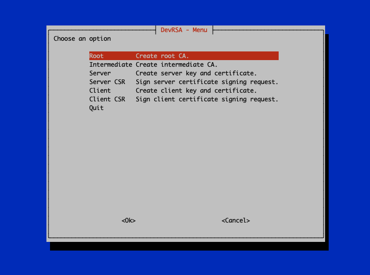

# DevRSA - Development PKI tool


# Overview

Nowadays more and more software requires certificates to run properly. During 
development this can be a burden, especially when adding the proper configuration 
and/or parameters.

DevRSA is based on [EasyRSA](https://github.com/OpenVPN/easy-rsa) and can be 
used to quickly generate a PKI CA for development purposes.

Do __NOT__ use DevRSA in production!

# Screenshots



# Running DevRSA

## Docker

Clone this repository and run:
```shell
cd dev-rsa

docker build -t dev-rsa .

docker run --rm -ti -v $PWD:/pki dev-rsa bash /pki/dev-rsa.sh
```

## Debian

Install EasyRSA and Whiptail:
```shell
sudo apt update && sudo apt install easy-rsa whiptail
```
Add easy-rsa to `$PATH` or add a symlink to for example: `/usr/local/bin`. Clone 
this repository and run:
```shell
bash dev-rsa.sh
```

# Configuration and usage

By editing the variables `root_ca` and `sub_ca_list` in the `dev-rsa.sh` file, 
the root and sub CA's can be configured.

Use the vars file to configure EasyRSA. The included file contains an example 
configuration.

1. Start DevRSA
1. Create a root CA
1. Create an intermediate CA
1. Create a server or client certificate

The generated certificates can be found in the `pki/` folder.
